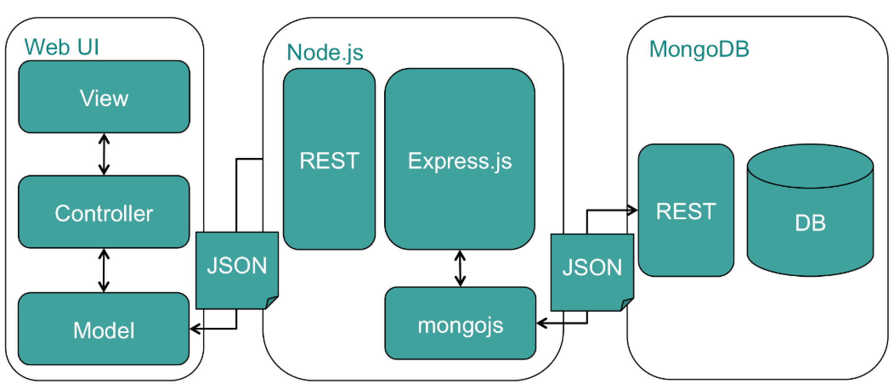

# TradeXchange - Your One-Stop Tech Trading Platform

## Software requirements
1. VSCode
2. Nodejs

## Used Packages

1. nodemon : ^2.0.20
1. bcrypt : ^5.1.0
3. connect-flash : ^0.1.1
4. connect-mongo : ^4.6.0
5. ejs : ^3.1.8
6. express : ^4.18.2,
7. express-rate-limit : ^6.7.0
8. express-session : ^1.17.3
9. express-validator : ^6.14.2
10. method-override : ^3.0.0
11. mongodb : ^4.12.1
12. mongoose : ^6.8.0
13. morgan : ^1.10.0

## Steps to run the project

1. Clone the Githib repository
2. Install the required packages from packages.json by using npm install
3. start running the application by using nodemon start

##  Introduction

Tradexchange is an online platform designed to connect tech enthusiasts and users who want to trade laptops, mobile devices, and accessories seamlessly. Whether you're looking to upgrade your gadgets or find a new home for your old tech, Tradexchange offers a user-friendly interface and robust features to make tech trading easy and secure.

## Architecture

### Architecture Diagram:

## Key Features
### Home page :
Upon visiting Tradexchange, users are greeted with a well-organized homepage. The homepage features a brief description of the platform's purpose and benefits. It also highlights key functionalities and the latest trades.

### User Authentication :
To access Tradexchange's full suite of features, users must create an account or log in. User authentication ensures the security and privacy of each user's profile and trade history.

### user Profiles:

Upon registration, users can create and personalize their profiles. Profiles include details such as username, profile picture, location, and a bio.

### Viewing Available Trades:

After logging in, users can browse multiple available trades. Trades are categorized by product type, condition (new or used), and location.Users can filter trades based on their preferences.

### Creating a New Trade:

Users can post their own trades by providing detailed listings. Listing details include product name, description, condition, photos, and desired items in return. Users can set preferences for trade conditions (e.g., local pickup only or shipping allowed).

### Trade Requests:

Interested users can send trade requests to the posters of the trades. Trade requests include a message outlining the proposed exchange. Users can negotiate the terms of the trade within the messaging system.

### Future Enhancements:

* Implement a search functionality to help users find specific products more easily.
* Add a reporting system for any suspicious or inappropriate listings.
* Integrate a payment system for trading high-value items securely.
* Develop mobile apps for iOS and Android platforms to expand the user base.
* Explore the possibility of expanding into other tech-related categories such as gaming consoles and smart home devices.